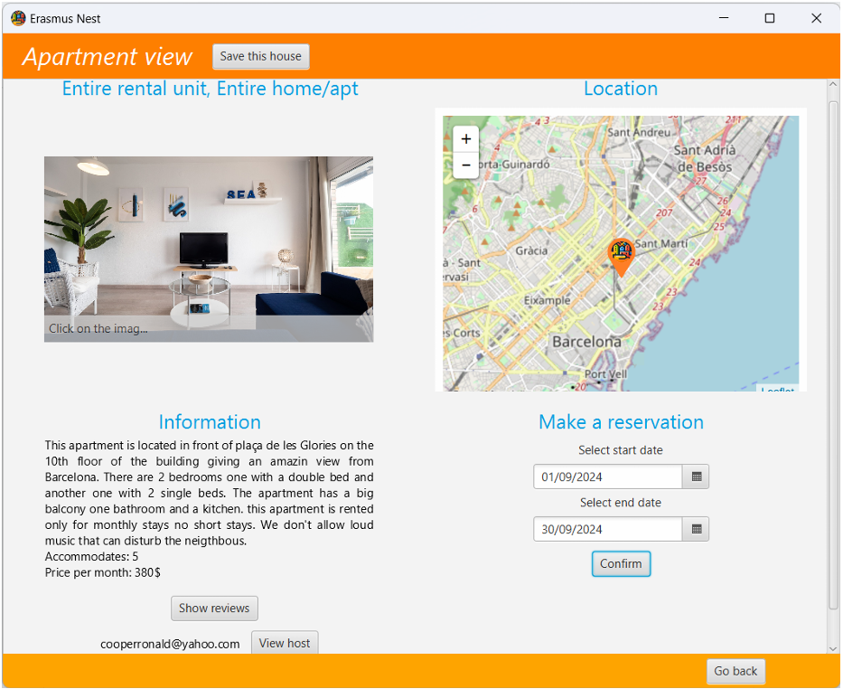

# ErasmusNest

ErasmusNest is an application designed to assist Erasmus students in finding accommodation and help property owners advertise their listings. The app features a review system and personalized recommendations based on users' likes and preferences. Its main strenght resides in its high scalability functionalities, mainly because of the usage of :

- **Redis** for caching the login of the users and their reservations
- **Neo4J** for the relations between the users and the apartments
- **MongoDB** for the apartemnts and the users

The project was developed during the Large Scale and Multistructured Databases course @Unipi, A.A 2023/2024.

Extensive information can be found in the [report](ErasmusNest_Report_LargeScale.pdf).

## Features

- **Apartment Search**: Students can search for apartments based on various filters, such as city, price, number of bathrooms, etc., and view details of available listings.
- **Reviews**: Users can write reviews for apartments they have stayed in and view reviews left by other users.
- **Apartment Management**: Property owners can upload new listings, modify existing apartment details, and remove properties.
- **Personalized Recommendations**: Users receive personalized apartment suggestions based on their likes and preferences.
- **Booking Management**: Users can view and manage their active bookings, including dates, price, and status.
- **Profile Management**: Users can update their personal information, including field of study and city of interest.

## License

This project is distributed under the MIT License. See the [LICENSE](LICENSE) file for more details.
